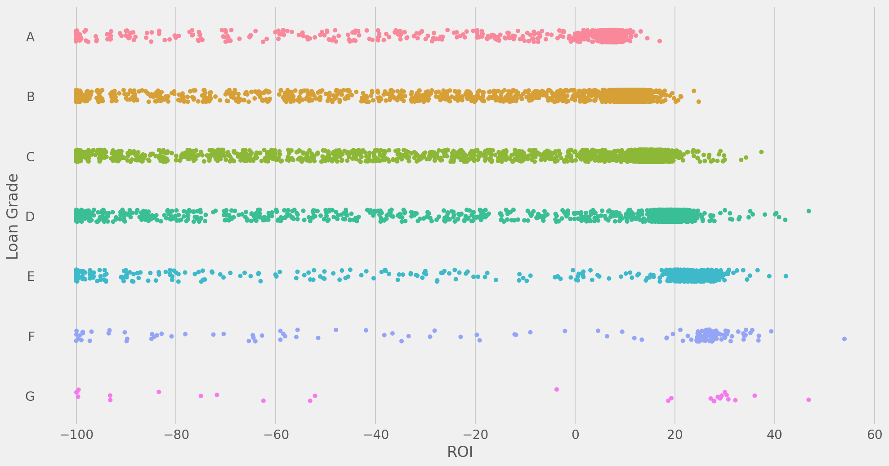
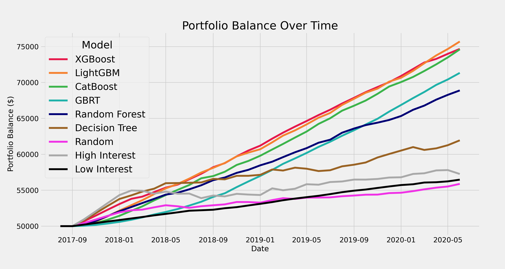

# Social Capital
## Predicting the Return on Investment (ROI) of Crowd-Funded Loans

#### 2021 Update:

Effective December 31, 2020, Lending Club has retired the loan investment platform for individual investors. As a result, the models trained here can no longer be integerated with API calls to programmatically invest in new loans and no new data will be released. However, I will be continuing to use this dataset to experiment and expand my machine learning expertise. Some of the ideas I'm currently exploring:

* Writing custom, asymmetric loss functions to penalize models more for overprediction than underprediction of ROI in the hopes of seeing improved portfolio performance

* New boosting model types, including CatBoost and LightGBM

* Ensembling of boosting models

* SHAP value analysis for model interpretability

* GPU acceleration, both for model training and SHAP analysis

_________________________

## Table of Contents
_________________________

1. [Background](#background)
    * [Objective](#objective)
2. [Loan Data](#data)
3. [Exploratory Data Analysis](#exploratory-data-analysis)
3. Machine Learning
4. Portfolio Simulation

## Background

The stock market has its purpose, but wouldn't you enjoy investing your money in real people? That is the goal of crowd-funded loans issued by [Lending Club](https://www.lendingclub.com/). Here's how it works:

> Bob has \$20,000 in credit card debt and is being charged 40\% interest by his credit card company. Bob comes to Lending Club hoping for a loan at a lower interest rate to help him pay off his debt quicker. Lending Club's non-traditional credit model decides that Bob isn't as risky of a borrower as he appears and should be paying a lower interest rate of, say 15\%. Lending Club then offers Bob a loan of \$20,000 at 15\% interest in order to pay off his credit card debt. However, Lending Club will not be funding the loan itself. Instead, individual investors decide if they want to "crowd-fund" Bob's loan.

Investors on the Lending Club platform can "invest" to fund Bob's loan. You invest by funding a portion of the loan, and then you receive payments as he pays off the loan. However, if he defaults on his loan you lose your portion of the unpaid balance.

This scenario is a win for both the borrower and the investors. Bob gets to pay off his debt at a lower interest rate, saving thousands in interest payments and penalties. Investors win by (hopefully) earning a significant return on their investment.

Investors don't want to lose money though, which leads us to our objective:

### Objective

Train a machine learning model to accurately predict the return on investment (ROI) of Lending Club loans. Integrate this model with code that was written previously to programmatically invest in loans through Lending Club's investor API. Use this system to help my friends and family with Lending Club accounts avoid loans with low or negative returns. 

## Loan Data

Lending Club had previously made all of their loan issuance and loan payments data public. This changed at the end of 2020 though with the retirement of their investing platform. Now all that's left are copies on the internet. Please see my folder [here](https://drive.google.com/drive/folders/1keM8zI9l5lWImY7tfggPMPWxuqStfb87?usp=sharing) for the 22 CSV files I have containing all the the issued loan data.

Many loans issued in 2007, 2008, and 2009 defaulted due to the effects of "The Great Recession". Lending Club ended up making changes to their credit model in an attempt to avoid seeing such a large number of loan defaults again. As a result, I have chosen to use only those loans issued in January 2010 or later. I have also chosen to exclude 60 month loans and focus on 36 month loans, as there are more completed loans available to train on. In the future I will expand this analysis to include 60 month loans. 

This results in data containing:

* 1,894,891 total loans
* 1,097,123 completed loans
*   797,768 still active loans

Lending Club provides over 100 features for each loan. The table below shows ten features as an example. 

| Feature Name        | Description                                                                          |
|:-:| :-: |
| `loan_amnt`           | The amount being borrowed.                                                           |
| `int_rate`            | Interest rate of the loan.                                                           |
| `grade`               | What grade (A-F) has Lending Club's internal credit model assigned to this borrower? |
| `emp_length`          | How long has the borrower been employed at their current job?                        |
| `home_ownership`      | Does the borrower rent or own their home?                                            |
| `annual_inc `         | What is the borrower's annual income?                                                |
| `verification_status` | Has the borrower's self-reported income information been verified?                   |
| `purpose `            | What is the purpose of the loan?                                                     |
| `dti`                 | What is the borrower's debt-to-income ratio?                                         |
| `installment `        | Monthly payment due from borrower.                                                   |

Please see the [data dictionary](https://docs.google.com/spreadsheets/d/1d73eTwcifrFPEeMyrTd-3TjjvdDummkDu0tn_G-s7UY/edit?usp=sharing) for a full list of available features.

More 2021 updates coming soon...

## Exploratory Data Analysis

